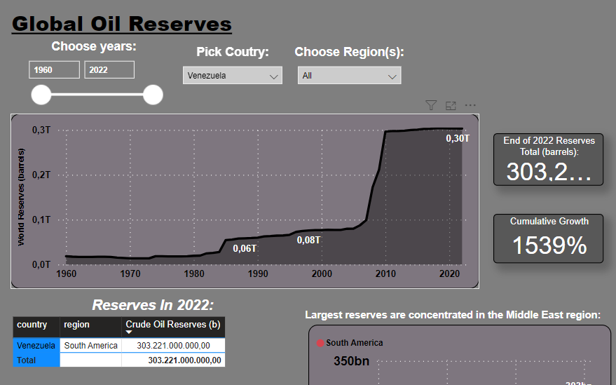
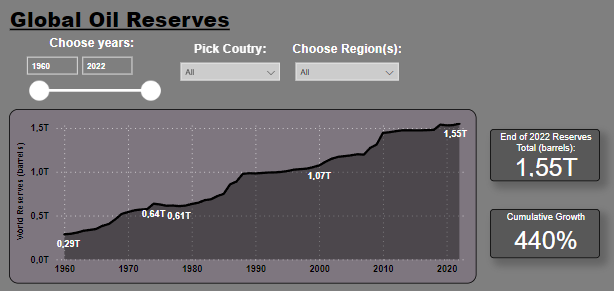

# Crude Oil Global Market

## 1. About this project
In this project I mainly use Power BI and to clean, manipulate,  and visualize data from the Petroleum Industry, obtained from OPEC (Organization of the Petroleum Exporting Countries).

I chose to work with a dataset that was related to a variety of subjects that interest me, such as international markets, historical analysis,  and bit of chemistry. Considering pretoleum and it derivates are commodities of high interest and debate over the years, I felt the oil market was a great choice.

*Ultimately, this project's goal is to improve and demonstrate my skills as a aspiring Data Analyst.*

## 2. The Data

The data was obtained from OPEC's database, available from their [website](https://asb.opec.org/data/ASB_Data.php).

*Obs: Although many countries are not part of OPEC, the datasets has records from mostly all countries that participate in the Oil Market.*

From the available database I chose the following tables to start working with (*The original table numeration from the database was maintained*):

    Crude Oil data:
    - Table 3.1 World proven crude oil reserves by country (mb).xlsx
    - Table 5.6 World imports of crude oil by country (1,000 b/d)
    - Table 4.7 World oil demand (downstream industry) by country (1,000 b/d)
    - Table 7.2 Selected spot crude oil prices ($/b)

At the time of writing, the datasets contain data from the year 1960 up to 2022. 

Important Data Information:

    Oil reserves are measured in million barrels (mb), and Spot Price in $US per barrel.
    
    Demand and imports are given in 1000 barrels per day (average) and is recorded at the end of each year. In other words, the data given is the average number of barrels per day produced in that year. 

    Volume of the barrel: 42 gallons (US) or 159 liters.

Definitions:

    Oil reserves denote discovered quantities of crude oil that can be profitably produced/recovered from an approved development. - Source: [Petroleum Resource Management System, SPE (2018)](https://www.spe.org/en/industry/petroleum-resources-management-system-2018/).

    Output: crude oil extracted, part of the upstream operations, same as crude oil Production.

    Upstream: “Upstream operations include exploring new landscapes for oil potential, discovering the crude oil, drilling and extracting it, and the initial discovery part. Another name for the upstream oil sector is the exploration and production (E&P) sector.” - Investopedia.

    Downstream: refers to the process of taking crude oil and turning into various derivatives. Thus, refers to demand for raw material from refineries and others. Anything after this is said to be further downstream. - “The closer an oil and gas company is to the process of providing consumers with petroleum products, the further downstream the company is said to be.” - Investopedia.

## 3. Objectives:
    To have a macroeconomic view of the global market of crude oil over the last 40 to 50 years. 
    For that we can begin by answering basic questions:
    - Which countries have the largest oil reserves?
    - Which countries have added or increased more their reserves over the years? And which have decreased the most?
    - Which countries have have the largest demands for crude oil?
    - Who imports the most crude oil?

## 4. Methodology:

### 4.1 Importing, Data Preparation and Data Processing

I imported the Excel files to Power BI, and I started using Power Query to prepare the data.

First I transformed the data structure from a wide format, with years spread across columns, to a long format where years were un-pivoted into a single column. This facilitated subsequent analysis.

Furthermore, the raw data included summaries of the each continents total, which could create redundancy in the analysis. Because of that, those records were filtered from the datasets. 

Basic cleaning was perfomed, assigning the correct formats, fixing typos and creating a naming convention for each column.

I then noticed the tables had no unique identifiers, which could become a problem. To address this, I created a bridge table using a DAX funcion, which recorded all possible country-year combinations and assigned a unique identifier to each pair. <!-- This step enabled the creation of one-to-many relationships between this bridge table and all other, enabling us to connect the data while ensuring integrity and consistency in the analysis. -->
With this part complete, we proceed to the analysis phase.

### 4.2 Analysis

<!-- 
- Changes after inflexion points (mainly 2008 and 2019 for the financial crisis and COVID respectivelly).
- Measures: mean, median, STD, Min, Max 
- Correlation
- % of total reserves belong too the top 5?
-->

## 5. Results :

### 5.1 Oil Reserves

It is known that a general concern of people when it comes to crude oil, other than the negative impact to the environment, is the fact that it is a finite source, meaning we can't create new crude oil, we can only extract what is available. That means it would likely be a bad idea to depend on something that might run out in the future.
So, looking at how the total reserves of explorable oil have been behaving over the years, we can have an idea if that is something we should be worried about in the near future. 

From the image we can see that over time, even with the huge demand for this commodity in the world economy (see demand section below), we have been able to find and explore more oil then we have consumed. In fact, since 2019, we have reached a total of 1,5 Billion barrels in explorable reserves (1,5 million million barrels), the highest ever.

That means that, it seems unlikely that we will be running out of this commodity any time soon, as this trend is expected to continue, as countries continue to look to increase their oil reserves and reduce the reliance from imported oil when possible.

Next, we take a look at the 5 countries that have the largest oil reserves. We see these countries have been increasing their reserves consistently over the years, which means they are able too add to their reserves faster than are extracting or at the same rate. For these countries, the oil exploration is a major driver of their economy, and also a point of influence in global geopolitical scenarios. 

It is interesting to notice how much the reserves of Venezuela increased between the years 2005 and 2010, coming to the current position of largest reserves in the world. A jump larger than Saudi Arabia's over the years 1987 and 1988.

### 5.2 Demand for Crude Oil

The second graph shows a very different context. Demand is greater in the most industrialized countries with big economies, as expected. These countries are mostly preocupied with keeping their industries running and oil is a big part of that. The 5 most demanding countries of Crude Oil are: USA, China, Japan, Russia and Germany.

As mentioned before, the measures in the Y axis (demand and imported) is the **average** of barrels in that year, per day. To get the actual quantity of demand or imported oil, you could simply multiply the average given by 365. For the purposes of this analysis, we don't need to do this multiplication.

Looking at this graph, we can see the demand of the US for Oil has varied greatly over time. This in itself can be studied in depth as to why and how that has affected the USA economy and industry over time. These variations can be associated to internal policies or changes in geo politics, price (supply and demand), wars that the USA was involved over the years, and much more. 

In contract if we look at Germany, we see a nation that has maintained the same level of demand for Crude Oil over time, indicating that Germany has taken measures to control or even reduce their dependence of Oil, considering the German industry is one the largest in the world. 

### 5.3 Imports of Crude Oil

In countries where there is not enough local oil reserves to sustain the local industry, they require to import the necessary oil to meet the industry demand. 
This will give us an idea which countries are the most dependent on imported oil, and therefore, exposed to the international market, by having to depend and the major crude oil producers.  

### 5.4 Imported and Demand Correlation with Price

Price of Crude Oil like most commodities will follow supply and demand of the market. Nonetheless, as we can see, the Global market for Oil is complex and changes in price will affect different economies in varied ways. Drawing correlation between price and other metrics will give us an idea of how each country might deal with price variance of crude oil over time. 

As mentioned before, this is important because countries depend on large amount of oil to sustain their industrialized economy, and some countries are more dependent than other.

On the other side, we have seen that supply is mainly dictated by 5 major Crude Oil producers (as of today): Venezuela, Saudi Arabia, Iran, Iraq and Kuwait. These countries are likely to be drivers of the price of Oil.

### Country-Specific Analysis:

 <!-- Which countries have the most considerable crude oil reserves, and how does that compare with their global standing in terms of output and demand?

 Which countries depend the most of imported oil? -->

<!--
## Future Work ((part 2: Oil Products/Derivates) Global Market):

For future work, we dive deeper into the data available from OPEC, taking a look now at oil products, like gasoline and other crude oil fractions.

 #### Oil products (gasoline and other fractions):
- Table 4.5 World output of petroleum products by country (1,000 b/d).xlsx
- Table 5.3 World exports of petroleum products by country (1,000 b/d).xlsx
- Table 4.6 Oil demand by main petroleum product in OPEC Members (1,000 b/d)
- Table 4.8 World oil demand by main petroleum product and region (1,000 b/d)
- Table 5.7 World imports of petroleum products by country (1,000 b/d)
- Table 5.8 World imports of petroleum products by main petroleum product and region (1,000 b/d)
- Table 5.9 World imports of crude oil and petroleum products by country (1,000 b/d) 
- Table 7.6 Spot prices of petroleum products in major markets ($/b).xlsx
-->